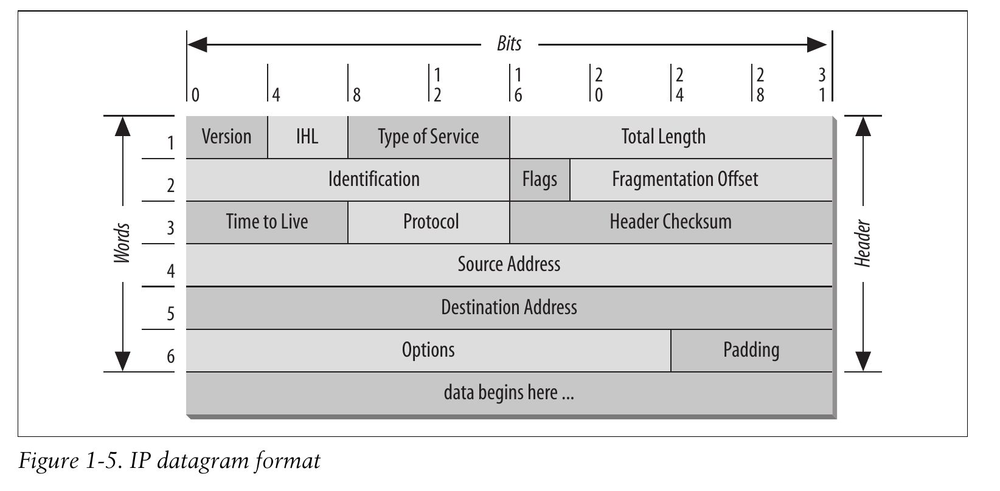
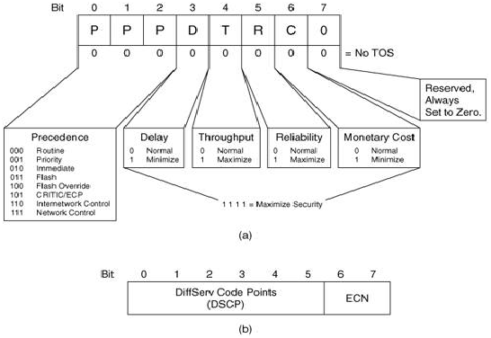

# Internet Protocol v4
[RFC 791](https://tools.ietf.org/html/rfc791) Internet Standard

## Summary
IP is a network addressing protocol for *internetworking* (connecting local networks between them). It is a **connectionless** and **decentralized** protocol. It is a network layer protocol (layer #3 in the OSI model).

## Functionalities
* Defining the **datagram** that is the basic unit of communication on the Internet ;
* Defining the Internet addressing scheme (universal addressing throughout the whole network) ;
* Linking the **Transport Layer** (host-to-host communication) and the **Network Access Layer** (basic protocols and hardware connections to send data on a network) ;
* **Routing** the datagrams to remote hosts ;
* Fragmenting and reassembling datagrams ;

### Connectionless protocol
As opposed to a **connection-oriented** protocol, the IP is not enabling sessions between communicating hosts. No information is exchanged to control if the message is correctly carried and received. IP does not provide **error detection** nor **error recovery**. That is the reason why it is sometimes called an *unreliable* protocol -meaning the error detection and the session functionnalities are left to other protocols-.

## Datagram

The header is composed of 6 32 bits words. As opposed to the Ethernet frame, some fields are shorter than a byte.

### Version
Coded on 4 bits, it is the id of the version of the Internet Protocol. Allows devices to interpret correctly the rest of the datagram.

++Common values++ :	4 (0100 ou 0x4) = IPv4 ; 6 (0110 ou 0x6) = IPv6

### IHL
Internet Header Length. Declares the length of current header in 32 bits words [5 - 15]. 5 words are mandatory, some options can produce more words.

### TOS / DSCP - ECN
Type Of Service 
Differentiated Services Codes Point - Explicit Congestion Notification
([RFC 3168](https://tools.ietf.org/html/rfc3168)).
These field is supposed to help define different levels and quality of service with flags of varied lengths. The problem being that many RFCs defined different uses and formats of these codes, some non backward-compatible. Some layer 3 equipments (*routers*) reinitialize this field to zero because they don't implement this functionality.

### Total Length
For the length of both header and data. Since it is coded on 16 bits, the datagram has a max size of 2^16 = 65535 Bytes.

### Identification
Common id number between fragment of the message.

### Flags
Describe the fragmentation
1. **Reserved** is always 0 ;
2. **DF** for `Don't fragment` ;
3. **MF** for `More fragments` for all fragments except the last one ;

### Fragmentation Offset
In 8 bytes blocks relatively to the first datagram. The first fragment has 0. The last fragment is identified by both the MF flag at 0 and the FO being not 0 at the same time.
### TTL
Time to live on one byte in seconds. In practice, it is rounded up to one for each transmission between gateways less than a second so it is effectively a **hop count**.
When reaches 0, the packet is dropped.

### Protocol
1 Bytes code for the protocol used in the data carried by the packet.

++Common protocols++ :
- 0x01 : ICMP
- 0x02 : IGMP
- 0x06 : TCP
- 0x11 : UDP

### Header checksum
Detection of error mecanism. The checksum is used to verify if the header (thus the packet) has been recieved without errors.

### Source & Destination address
Self-explanatory

### Options & padding
Various fields of options can be set. Options offer various additionnal informations like the timestamp, security options, the route used, etc.
IHL has to be above 5 for the networks equipments to know there are options enabled. The remaining bits are set to zero (padding).

## Routing
In IP logic, there are only two types of network devices :
* **Hosts** which are only able to emit and recieve datagrams
* **Gateways** that are hosts but also **forward packets** each time closer to their destination.

### Address classes
[Reference](https://en.wikipedia.org/wiki/IPv4#Addressing)
Classes are a way to guess the network mask 

#### Private addresses
`[10.0.0.0 ; 10.255.255.255]`
`[172.16.0.0 ; 172.31.255.255]`
`[192.168.0.0 ; 192.168.255.255]`

#### Forbiden addresses
`0.0.0.0`
`127.0.0.0`
`255.255.255.255`

## TODO
* Explain fragmentation mecanism and why some routers have to fragment a packet and others do not
* Explain legacy address classes and classless

## Sources
[Entête IP](http://www.frameip.com/entete-ip/) sur le site frameip.com
[IPv4](https://en.wikipedia.org/wiki/IPv4) sur Wikipedia Résumé
